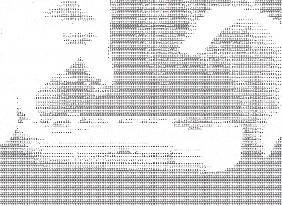

# Raspberry Pi ASCII-Cam

The __pi-ascii-cam__ project allows you to create an ASCII live camera stream from a Raspberry Pi with an attached Raspberry Pi Camera or any MJPEG stream.
It is utilizing `raspivid` to convert its MJPEG stream into an ASCII character representation and transport them over a websocket.

The servers are written in golang, the client is simply HTML/CSS/JavaScript.

## Binaries

You can find binaries for Linux and MacOS in `bin/`.

On plattforms other than the Raspberry Pi, `asciicam-server` will only be able to do a conversion from MJPEG to ASCII from an external network source. See [Receive an external MJPEG stream](#receive-an-external-mjpeg-stream) on how to do that.

I did not test all binaries. Just `linux-arm` and `macos-amd64`.

## Start the ASCII stream server

    ./asciicam-server

You are now able to connect to a websocket on port 8000 on all network interfaces. There is already an example HTML/JavaScript client you can host: `asciicam-server/example_client.html`. Use a webserver of your choice on the same machine. The client will connect automatically to the websocket.

Show all possible options and defaults:

    ./asciicam-server --help

## Serve clients from other machines

`asciicam-server` can server multiple clients, but a single Raspberry Pi could be quickly overwhelmed. Also you may not want to serve your stream directly from your office or home server.

The `asciicam-imux` is a very simple inverse multiplexer, which connects to your `asciicam-server`, splits the websocket stream for multiple clients and serves them.

To start a single server on an external machine just run:

    ./asciicam-imux -s 10.0.0.10:8000 -p 88888

__-s__ ip and port where `asciicam-server` is running

__-p__ the port you want your clients to connect to

### asciicam-imux docker image

You can use the existing Dockerfile to build your own image or use the ones already available on hub.docker.com.

* [leonlaser/pi-asciicam-imux](https://hub.docker.com/r/leonlaser/pi-asciicam-imux/)
* [leonlaser/pi-asciicam-imux-arm](https://hub.docker.com/r/leonlaser/pi-asciicam-imux-arm/) for usage on a Raspberry Pi

Run the docker image

    docker run -p 9000:9000 -e PORT=9000 -e SOURCE=10.0.0.10:8000 leonlaser/pi-asciicam-imux

## Receive an external MJPEG stream

The `asciicam-server` calls `raspvid` directly and uses its MJPEG stream on stdout to generate the ASCII frames.

A Raspberry Pi Zero is quickly overwhelmed when converting 10 frames per second or more and serving a websocket connection.

To remove the load of converting frames, you can use your Raspberry Pi to only start `raspivid` itself and stream the MJPEG over the network with netcat:

    raspivid -o - -w 320 -h 200 -n -t 0 -cd MJPEG -fps 25 | nc -lkv4 5001

In my expierence netcat somehow gives up at some point. A better alternative for me was to use `ncat`, which belongs to `nmap` and will be installed with it:

    raspivid -o - -w 320 -h 200 -n -t 0 -cd MJPEG -fps 25 | ncat -k -l 5001

Now use `asciicam-server` to connect and open a new websocket:

    ./asciicam-server -net 10.0.0.1:5001

Now your Raspberry Pi only sends a video stream and another machine running `asciicam-server` can convert your video and serve the websocket connections.

Based on your needs, your clients can directly connect to your `asciicam-server` or you can use `asciicam-imux` to scale:

-> Raspberry Pi running `raspivid` streams to -> a Machine running `asciicam-server` serving a websocket, which gets distributes by -> n-Machines running `asciicam-imux` in a docker swarm or using a loadbalancer for your clients to connect to.

## Using an USB webcam

Because `asciicam-server` is able to retrieve any MPJEG stream, you can use any source and convert it to an ASCII video. Here is an example on using `avconv` to access you local video device and start an MJPEG stream:

    avconv -f video4linux2 -s 320x200 -i /dev/video0 -r 15 -f mjpeg tcp://0.0.0.0:5001?listen

Now use `asciicam-server` with the `-net` parameter to connect.

# Client

Without a client nobody can see your live stream. You can use two different files. As mentioned earlier, there is a really simple client to show you what is going on: `asciicam-server/example_client.html`.

`webclient/webclient.html` is a bit more advanced, allowing you to connect to any websocket stream by entering an address. It is using requestAnimationFrame() and shows the frames per second, received through the websocket connection. It is very helpfull for debugging your setup.

# Build

This section is mostly for myself. But if you want to built your own setup for streaming your video feed, want to modify the sources and deploy them on different machines, help yourself:

## Compile go sources

See makefile.

## Build docker images

See makefile.

# But why?

I was looking for project to learn more about golang, Docker, Docker Swarm and Raspberry Pi.

# Thanks

A thank you goes to [idevelop](https://github.com/idevelop) for his awesome [ascii-camera](https://github.com/idevelop/ascii-camera). My image to character conversion is simply a port of his [ascii.js](https://github.com/idevelop/ascii-camera/blob/master/script/ascii.js), which features some links to every step of his image pre-processing before converting it to actual characters.